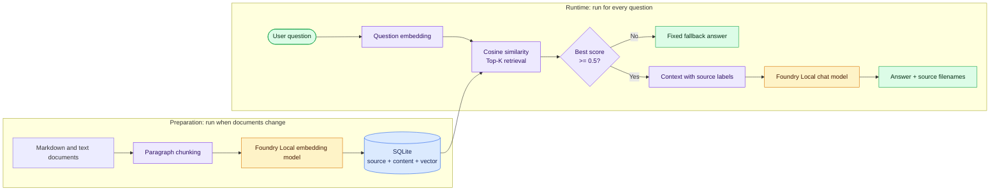
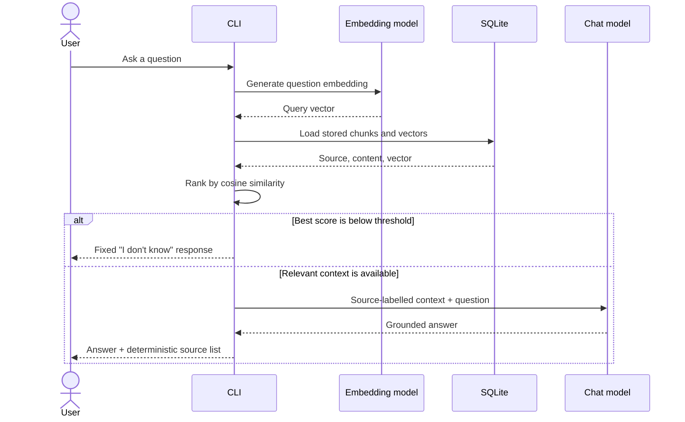

# Local RAG Assistant with Microsoft Foundry Local

A fully local, document-grounded question-answering assistant built with
Microsoft Foundry Local, Python, SQLite, and Retrieval-Augmented Generation
(RAG).

The application retrieves relevant passages from a local knowledge base,
provides them to an on-device language model, and prints both the answer and the
source filenames used as context. After the required models and execution
providers have been downloaded, ordinary inference can run without sending
prompts, documents, or model outputs to a cloud service.

This repository was developed as a Microsoft AI Innovators internship capstone
project. It includes the application, component prototypes, automated tests,
two evaluation sets, architecture documentation, an engineering journal, and a
technical report.

## Project at a glance

| Area | Implementation |
|---|---|
| Interface | Documentation web app, JSON API, and CLI |
| Chat model | `qwen2.5-1.5b` |
| Embedding model | `qwen3-embedding-0.6b` |
| Data store | SQLite |
| Retrieval | Brute-force cosine similarity |
| Retrieval depth | Top 3 chunks |
| Similarity threshold | `0.5` |
| Knowledge base | 26 chunks across 5 Markdown files |
| Source attribution | Filename retained from ingestion to final answer |
| Development evaluation | 8/10 |
| Frozen blind evaluation | 7/10 |
| Automated tests | 38 tests |

## Architecture

The system has two paths: an offline preparation path that builds the knowledge
base and a runtime path that answers each question.



### Retrieval and generation sequence



## How the pipeline works

### 1. Ingestion

[`src/ingest.py`](src/ingest.py) reads every `.md` and `.txt` file in `data/`,
splits each document on blank lines, generates one embedding per paragraph, and
stores the following fields in SQLite:

| Field | Purpose |
|---|---|
| `id` | Stable row identifier |
| `source` | Original filename used for attribution |
| `content` | Retrieved text passage |
| `embedding` | JSON-serialized embedding vector |

Ingestion is idempotent: every run clears and rebuilds the generated chunk
table. The setup function also migrates databases created by the earlier schema
that did not contain a `source` column.

### 2. Retrieval

[`src/retrieve.py`](src/retrieve.py) embeds the question with the same embedding
model, loads the stored vectors, calculates cosine similarity, sorts all chunks,
and returns the three highest-scoring `(score, content, source)` results.

Brute-force comparison is intentional. It is exact, easy to inspect, and fast
enough for the current 26-chunk corpus. A vector index would add deployment and
debugging complexity without a measurable benefit at this scale.

### 3. Grounded answer generation

[`src/answer.py`](src/answer.py) applies two safeguards:

1. If the best similarity score is below `0.5`, the chat model is not called and
   the application returns a fixed fallback.
2. Otherwise, retrieved passages are labelled with their source filenames and
   placed in the system prompt with an instruction to use only that context.

For supported answers, the application appends a stable, de-duplicated source
list. If the model itself returns the exact fallback, unrelated retrieved files
are not printed as sources.

### 4. Web application and CLI

[`src/web.py`](src/web.py) provides a FastAPI backend with health, source, and
question-answering endpoints. The responsive interface in `web/` combines a
Foundry Local learning guide with a source-aware AI assistant. Models load
lazily on the first question and are reused for the server session.

[`src/main.py`](src/main.py) remains available as a lightweight terminal
interface. Both interfaces use the same retrieval and answer pipeline.

Example:

```text
> Do I need an Azure subscription to use Foundry Local?

No. Foundry Local does not require an Azure subscription and runs on local
hardware.

Sources: azure_and_privacy.md, what_is_foundry_local.md
```

## Requirements

- Python 3.11 or later; development and validation used Python 3.12
- At least 8 GB RAM; 16 GB is preferable for local model work
- Internet access during the first model/execution-provider download
- Sufficient disk space for the selected models
- Windows, macOS, or Linux supported by the selected Foundry Local package

Foundry Local provides two Python packages with the same API:

| Environment | Package | Requirements file |
|---|---|---|
| Windows with Windows ML acceleration | `foundry-local-sdk-winml` | `requirements.txt` |
| macOS, Linux, or Windows without WinML | `foundry-local-sdk` | `requirements-cross-platform.txt` |

Do not install both SDK variants in the same environment because their ONNX
Runtime dependencies conflict. The complete application and live evaluation
were validated on Windows. The cross-platform dependency path is documented but
has not been physically tested on macOS or Linux in this project.

## Installation

### Windows

```powershell
git clone https://github.com/bilgenurpala/local-rag-assistant.git
cd local-rag-assistant

py -3.12 -m venv .venv
.\.venv\Scripts\Activate.ps1
python -m pip install --upgrade pip
pip install -r requirements.txt
```

### macOS or Linux

```bash
git clone https://github.com/bilgenurpala/local-rag-assistant.git
cd local-rag-assistant

python3 -m venv .venv
source .venv/bin/activate
python -m pip install --upgrade pip
pip install -r requirements-cross-platform.txt
```

Run all commands from the repository root. The application intentionally
resolves `data/` and `rag.db` relative to the current working directory.

## Build the knowledge base

```powershell
python src\ingest.py
```

On the first run, Foundry Local may download the model and execution provider.
The current corpus produces:

```text
Found 5 documents in data/
Done. 26 chunks written to rag.db
```

To use custom content, add UTF-8 `.md` or `.txt` files to `data/` and run
ingestion again. Short, self-contained, single-topic paragraphs generally
retrieve more reliably than long multi-topic passages.

## Public interface demo

Explore the
[Foundry Local Guide public demo](https://foundry-local-guide-demo.blgnrylmzr13192.chatgpt.site)
to preview the documentation experience and responsive chat interface.

The hosted version uses example responses because the Foundry Local runtime,
models, knowledge base, and RAG pipeline remain on the local device. Run the
application below to use real document retrieval and on-device generation.

## Run the web application

```powershell
python -m uvicorn web:app --app-dir src --reload
```

Open `http://127.0.0.1:8000`. The page includes:

- A structured Foundry Local learning guide
- Local RAG architecture explanation
- Python SDK quickstart
- Offline and privacy guidance
- Knowledge-source inventory
- Suggested questions and a live AI chat panel
- Source-aware answers without exposing internal filenames in the chat

The JSON API is available at:

| Endpoint | Purpose |
|---|---|
| `GET /api/health` | Report whether local models are loaded |
| `GET /api/sources` | List knowledge-base documents |
| `POST /api/ask` | Answer a documentation question |

Example request:

```json
{
  "question": "Do I need an Azure subscription?"
}
```

Example response:

```json
{
  "answer": "No. Foundry Local runs on local hardware.",
  "sources": ["azure_and_privacy.md", "what_is_foundry_local.md"]
}
```

## Run the CLI

```powershell
python src\main.py
```

Type a question at the prompt. Type `exit` or `quit` to stop.

## Testing

```powershell
pytest
```

The 38-test suite runs without loading a model. It covers:

- Paragraph chunking and document loading
- SQLite schema creation, migration, and idempotent rebuilds
- Cosine similarity, zero vectors, and vector-length validation
- Retrieval ordering and source propagation
- Similarity threshold boundaries
- Context construction and deterministic source formatting
- Exact fallback behavior
- Empty CLI input and model cleanup
- Frozen blind-evaluation acceptance rules
- Web response parsing and source serialization
- FastAPI health and question-answering endpoints
- Static web interface delivery

## Evaluation

Two distinct evaluations are preserved.

| Evaluation | Purpose | Result | Status |
|---|---|---:|---|
| Development set | Tune and diagnose retrieval/prompt choices | 8/10 | Not an unbiased estimate |
| Frozen blind set | Validate once after configuration was fixed | 7/10 | Independent validation evidence |

The development evaluation contains five answerable and five unsupported
questions and records the path through five measured configurations. The blind
set uses ten different questions that were not used to select the model,
threshold, Top-K value, prompt, or corpus wording.

Run the development evaluation:

```powershell
python prototypes\evaluation_run.py
```

Inspect retrieval for one question:

```powershell
python prototypes\inspect_retrieval.py "Which platforms are supported?" 5
```

The blind set has already been run and is frozen. Its raw answers, scores, and
latencies are committed for auditability; it should not be repeatedly tuned
against.

- [`docs/evaluation.md`](docs/evaluation.md): development method and analysis
- [`docs/blind-evaluation.md`](docs/blind-evaluation.md): blind method and
  failure analysis
- [`docs/blind-evaluation-results.json`](docs/blind-evaluation-results.json):
  complete machine-readable results

### What the results mean

The assistant works reliably for many direct questions and correctly refuses
some unsupported ones. The blind set also exposes the central remaining
limitation: a semantically related passage can pass the threshold without
actually answering the question, and a small generator can then use outside
knowledge despite the grounding instruction.

The project reports this behavior rather than hiding it. The next meaningful
research direction is a mechanical evidence check or hybrid keyword/vector
retrieval, not repeated prompt tuning against the validation set.

## Offline and privacy behavior

Normal inference is local after the required artifacts are cached:

- Document chunks and embeddings remain in the local SQLite file.
- Questions and generated responses are processed on the device.
- No Azure subscription or hosted inference endpoint is required.
- There is no per-request API billing.

Offline does not mean the network is never used. A connection may still be
required to download a new model or execution provider, or to refresh the model
catalog. Optional diagnostics may also transmit data if the user explicitly
chooses to share logs.

## Repository structure

```text
local-rag-assistant/
|-- data/                              Knowledge-base documents
|-- docs/
|   |-- architecture.md                Design rationale and diagrams
|   |-- engineering-journal.md         Decisions, problems, and outcomes
|   |-- evaluation.md                  Development evaluation
|   |-- blind-evaluation.md            Frozen validation summary
|   |-- blind-evaluation-results.json  Raw blind results
|   `-- technical-report.md            Final technical report
|-- prototypes/                        Component and evaluation experiments
|-- src/
|   |-- ingest.py                      Chunk, embed, and store
|   |-- retrieve.py                    Rank relevant chunks
|   |-- answer.py                      Ground and attribute answers
|   |-- web.py                         FastAPI and static web server
|   `-- main.py                        Interactive CLI
|-- tests/                             Automated test suite
|-- web/                               Documentation and chat interface
|-- requirements.txt                   Windows/WinML dependencies
`-- requirements-cross-platform.txt    Cross-platform dependencies
```

## Engineering decisions

| Decision | Rationale |
|---|---|
| Paragraph chunks | Transparent and appropriate for a small authored corpus |
| JSON vectors in SQLite | Portable and sufficient at the current scale |
| Hand-written cosine similarity | Keeps the central retrieval concept inspectable |
| Dependency-injected embedding client | Avoids repeated model loads and enables fast tests |
| Fixed threshold fallback | Prevents unnecessary generation on clearly unrelated queries |
| Source stored with every chunk | Makes supported answers auditable |
| Frozen second evaluation | Separates development feedback from validation evidence |

The detailed reasoning and failed experiments are recorded in
[`docs/engineering-journal.md`](docs/engineering-journal.md) and
[`docs/technical-report.md`](docs/technical-report.md).

## Known limitations

- Source attribution names retrieved files, not the exact sentence supporting
  every generated claim.
- Retrieval is semantic only; exact terminology does not receive a keyword
  boost.
- The small chat model can still produce confident unsupported answers when
  related context passes the threshold.
- Retrieval scans every vector and is designed for a small, single-user corpus.
- The live application has been validated on Windows; macOS and Linux need
  device-level verification.
- The blind set is intentionally frozen and should not become another tuning
  set.

## Troubleshooting

### Model alias is not found

The model catalog may require a network connection to refresh. Confirm the
connection and inspect available aliases:

```powershell
foundry model list
```

### Foundry SDK dependency conflict

Make sure `foundry-local-sdk` and `foundry-local-sdk-winml` are not installed in
the same virtual environment. Recreate the environment with the single
requirements file appropriate for the target platform.

### Database schema or corpus changed

Re-run ingestion:

```powershell
python src\ingest.py
```

The ingestion process migrates the earlier schema and rebuilds all rows.

### The application cannot find `data/` or `rag.db`

Return to the repository root before running any script. Do not run
`python main.py` from inside `src/`.

### Windows virtual machine returns empty model output

The WinML backend expects physical DirectX 12-capable GPU hardware for
acceleration. A virtual machine without GPU passthrough may need the
cross-platform SDK instead.

## Presentation video

Watch the short project presentation to learn what was built and what I learned
during the Microsoft AI Innovators Program:

[Watch the Local RAG Assistant presentation on YouTube](https://youtu.be/bbYbv7VwyW4)

## Primary references

- [Get started with Foundry Local](https://learn.microsoft.com/en-us/windows/ai/foundry-local/get-started)
- [Foundry Local documentation](https://learn.microsoft.com/en-us/azure/foundry-local/)
- [Integrate Foundry Local with inference SDKs](https://learn.microsoft.com/en-us/azure/foundry-local/how-to/how-to-integrate-with-inference-sdks)
- [Build your first local RAG application with Foundry Local](https://techcommunity.microsoft.com/blog/azuredevcommunityblog/building-your-first-local-rag-application-with-foundry-local/4501968)
- [SQLite documentation](https://www.sqlite.org/docs.html)

## License

This project is licensed under the MIT License. See [`LICENSE`](LICENSE).
