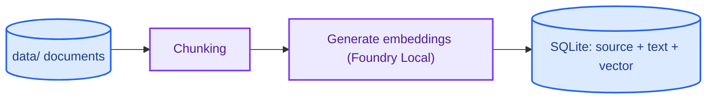
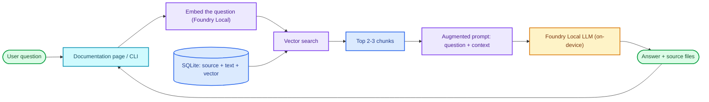

# Architecture

This document describes the components and data flow of the local RAG assistant.
The entire system runs on a single device, with no internet connection.

## Why RAG (Retrieve → Augment → Generate)

A language model on its own answers only from what it learned during training. For a
narrow, specific domain — such as the internal details of one particular tool — this
causes two problems: the model may not know the answer, and when it does not, it
tends to invent a plausible-sounding but wrong one (a "hallucination"). Retraining
the model on our own documents would be expensive and impractical for a project of
this size.

Retrieval-Augmented Generation (RAG) addresses this without changing the model at
all. Instead of relying on the model's memory, we supply the relevant text at
question time, in three steps:

1. **Retrieve** — The user's question is turned into a vector, and the document
   chunks whose vectors are most similar are located. These are the passages most
   likely to hold the answer.
2. **Augment** — Those chunks are placed into the prompt as context, alongside an
   instruction to answer using only this context.
3. **Generate** — The model produces an answer grounded in the supplied text. If the
   context does not contain the answer, it is told to reply "I don't know" instead of
   guessing.

Because every answer is tied to a retrieved passage, hallucination drops sharply and
the system stays explainable: any answer can be traced back to the chunk it came from.

A second deliberate choice is that the whole pipeline runs **on-device**, through
Microsoft Foundry Local — no cloud account, no API keys, no network calls. Documents
and questions never leave the machine (privacy), the system works without internet or
per-request billing (no dependency, no cost), and behaviour is reproducible on any
capable device. The trade-off is reliance on smaller local models rather than the
largest cloud ones; for a focused, document-grounded Q&A task, that is an acceptable
exchange and is the core constraint the rest of this architecture is built around.

## Components

| Component | Responsibility | Technology |
|---|---|---|
| Interface | Presents documentation, receives questions, displays answers and sources | FastAPI web app + CLI |
| Ingestion pipeline | Chunks documents, generates embeddings, stores them | Python + Foundry Local |
| Data layer | Stores text chunks and their vectors | SQLite |
| Retrieval | Finds the chunks most relevant to the question | Embedding + vector similarity |
| Generation | Writes the context-grounded answer | Foundry Local LLM (on-device) |

## Data Flow 1 — Preparation (Document Ingestion Pipeline)

Documents are processed once and written to the database. This step is not re-run
unless the documents change.

## Data Flow 2 — Query (Runtime)

The main RAG loop that runs every time the user asks a question:

## Design Principles

- **Offline-first:** After setup, no step requires the internet.
- **Source-grounded answers:** The model answers only from the retrieved context;
  if the context is insufficient, it says "I don't know." Each retrieved passage
  retains its filename, and supported answers print a deterministic source list.
- **Simplicity:** For a small dataset, vectors loaded from SQLite are compared in
  memory; if scale grows, migrating to a dedicated vector database can be considered.
- **Speed priority:** A small model is chosen; the goal is fast feedback.
